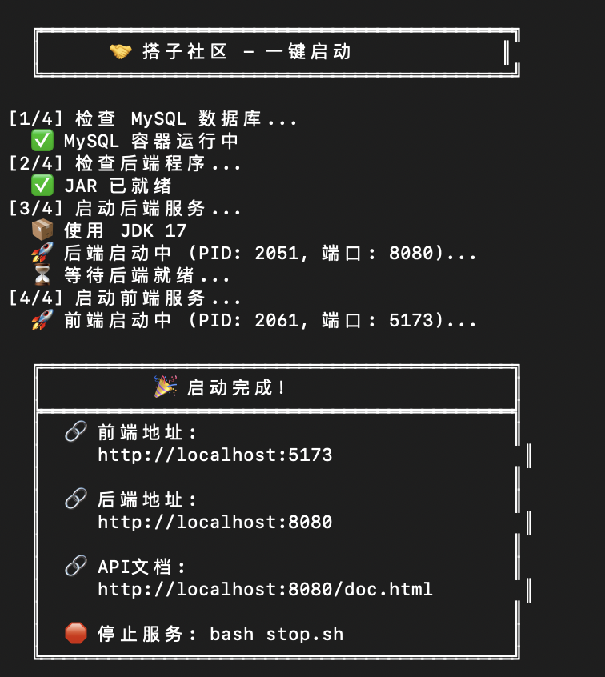
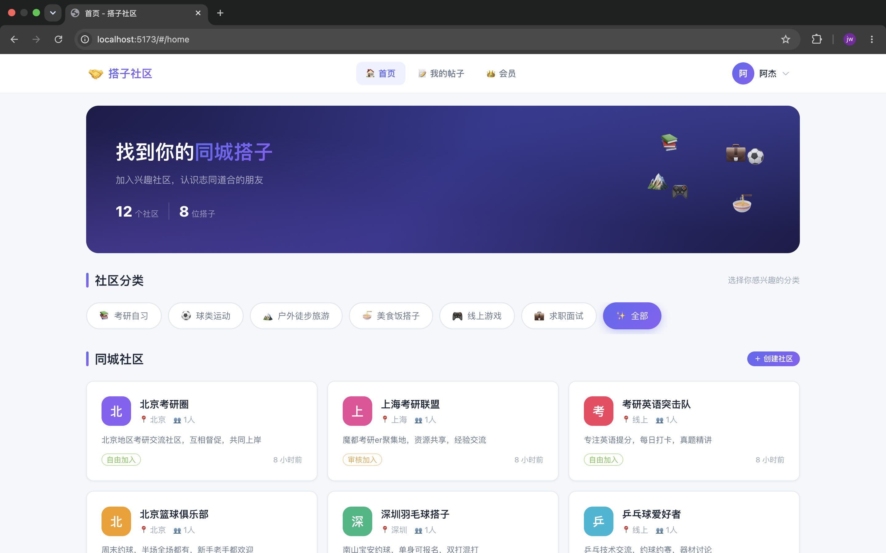
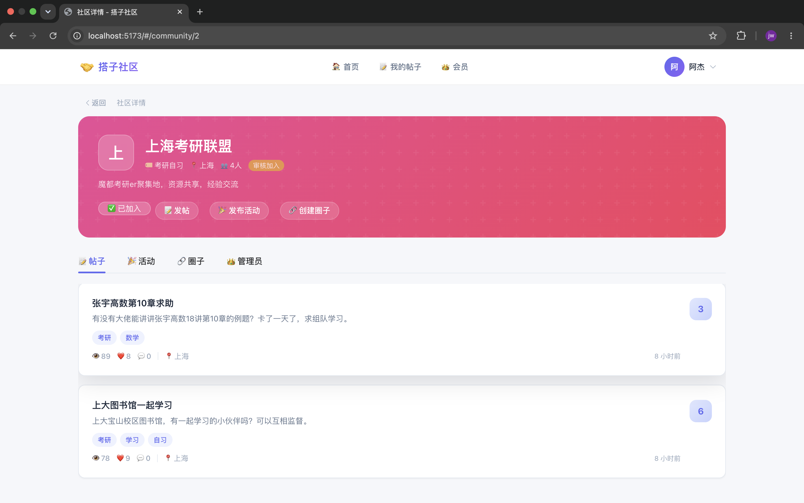

# 同城分层社区搭子平台
## 生成代码的提示词参考
请深刻详细的阅读我的需求文档@项目文档/同城分层社区搭子平台.md，按照该需求文档给出详细前后端实现，要求:
1.当你编写完成代码后自己进行测试，最终交付给我的代码可以直接运行访问前端可以进行完整业务流程操作
...

## 预安装环境
1. Docker（用于 MySQL 容器自动管理）
2. JDK17+ & Maven3.9.x
3. (Node.js>=16) + npm（前端 Vite 启动）
4. 系统内置工具（一般系统自带）
      lsof、curl、pkill/xargs、sleep、cd 等基础命令
      Mac 自带 lsof；极简 Linux 需手动安装 yum install lsof / apt install lsof curl

## 项目启动
1. 直接运行sh start.sh脚本，自动拉取依赖、编译、启动后端和前端
2. 配置mysql数据，分别执行初始化 init.sql 和 填充数据 seed_data.sql
3. 访问 http://localhost:5173， 
   - 手机号：13800138001
   - 验证码（相当于密码）：1234
4. 页面：
   - 启动页面
   
   - 首页
    
   - 社区详情
    
    
## 核心功能模块
- **账号实名模块**：手机号注册登录、微信快捷登录、三级实名、隐私设置、风控拦截
- **三层社区模块**：官方社区、用户自建社区、私密圈子、入群审核、社区管理
- **搭子匹配模块**：帖子发布、精准智能匹配、付费置顶、点赞收藏举报
- **活动运营模块**：线上线下活动发布、双重审核、报名支付、平台抽成
- **即时通讯模块**：单人私信、圈子群聊、实时消息同步
- **安全工具模块**：位置共享、紧急求助、人脸核验、线下安全提醒
- **付费变现模块**：会员订阅、单次增值付费、管理员收益分成、订单管理
- **后台管理模块**：用户管控、社区审核、内容风控、财务数据统计、商家管理

## 技术栈
### 前端技术栈
- 核心框架：Vue3 + Vite + TypeScript
- UI 组件：Element Plus
- 状态管理：Pinia
- 路由管理：Vue Router 4
- 网络请求：Axios（全局拦截统一封装）
- 实时通讯：Socket.io（聊天室、私信实时同步）
- 适配方案：PC + 移动端自适应布局
### 后端技术栈
- 核心框架：SpringBoot 3.x
- ORM 框架：Mybatis-Plus 最新版
- 数据库：MySQL 8.0
- 缓存中间件：Redis
- 权限鉴权：JWT + 全局拦截器
- 消息队列：RocketMQ（异步通知、订单处理）
- 定时任务：XXL-Job
- 实时通讯：WebSocket
- 接口文档：Knife4j/Swagger